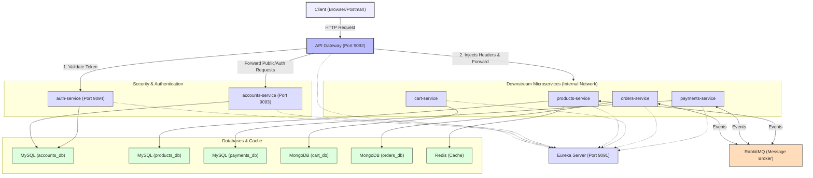

# Microsservices Store

E-Commerce Store is a REST API for an e-commerce store, based on microservices architecture, with both operations performed by the customer and operations performed by administrators.

This is an old project that I created at the beginning of the year, and this repository is intended for a complete refactoring of the project.

## System overview




<details>
  <summary><h2>Details</h2></summary>

### Eureka
- This is the discovery service. It acts as a hub where all microservices connect, allowing them to know each other.

### Gateway
- Main entry point of the application and load balancer.

### Common
- An internal library (`common-security`) that all microservices use to implement security features.
- Most services rely on it to build the Spring Security context from sanitized HTTP headers (`X-auth-user-*`) injected by the API Gateway.
- In addition to having it locally in the project, its package is also distributed via Github Packages, so even if it is not present locally, services will still be able to access the package.

### Auth
- Dedicated authentication and token validation service (`auth-service`).
- Validates the token signature and structure, returning sanitized user details to the API Gateway.

### Accounts
- Manages user accounts and credentials.
- Responsible for validating credentials and generating signed JWT tokens upon login.

### Products
- Manages products.
- Provides reliable product data to other microservices.

### Cart
- Manages customers' shopping carts.
- Allows the creation of carts for unauthenticated users, featuring the merging of the local cart with the authenticated user's cart.

### Orders
- Manages customer orders.
- Requests the generation and cancellation of payments.

### Payments
- Manages order payments.

</details>


<details>
  <summary><h2>Tecnologies</h2></summary>

- [Spring Boot]()
- [MongoDB](https://www.mongodb.com)
- [MySQL](https://dev.mysql.com/downloads/connector/j/)
- [Redis](https://redis.io/docs/latest/)
- [RabbitMQ](https://www.rabbitmq.com/)
- [Swagger](https://swagger.io/)
- [JWT](https://github.com/auth0/java-jwt)
- [Docker](https://www.docker.com/)
- [H2](https://www.h2database.com/html/main.html)
- [TestContainers](https://testcontainers.com/)

</details>


<details>
  <summary><h2>Documentation</h2></summary>

### Swagger UI

The application also has detailed documentation made with OpenAPI and Swagger UI.

To access it, run the containers and access the [documentation entry point](http://localhost:9092/swagger-ui/index.html) (Gateway). The documentation can be accessed centrally through the Gateway and also through the individual API itself (accounts, products, orders, cart, payments).

> **Note:**
> - Endpoints with the prefix "Admin" require you to be logged in as a user with ADMIN or EMPLOYEE permission
> - Endpoints with the prefix "Client" only work with users with CLIENT permission
> - Endpoints with "Internal" prefix do not accept external calls
> - The Accounts service is responsible for always creating a default administrator user, using the ADMIN_USERNAME and ADMIN_PASSWORD environment variables

<details>
  <summary><h3> Authentication and Authorization Flow (Centralized Security - V3)</h3></summary>

#### 1. User Authentication:
- The user authenticates against the Accounts service (`POST /accounts-ms/auth`).
- If credentials are valid, the Accounts service signs and generates a JWT token with user identification data: ID, username, and role, using the secret signature key `${JWT_SECRET}`.
- The user receives the JWT token.

#### 2. Request Interception and Sanitization (API Gateway):
- The client sends requests with the JWT token in the `Authorization: Bearer <token>` header.
- The API Gateway intercepts the request and removes any external `X-auth-user-*` headers to prevent header injection vulnerability.
- If the endpoint is protected:
  - The Gateway queries the dedicated `auth-service` (`GET /auth`), forwarding the `Authorization` header.
  - If the token is invalid or missing, the Gateway aborts the request and returns an HTTP 401 Unauthorized response.
  - If the token is valid, the `auth-service` decodes it, validates it, and returns the verified user data.
  - The Gateway then injects custom headers: `X-auth-user-id`, `X-auth-user-username`, and `X-auth-user-role` containing the verified identity, and forwards the request downstream.
- If the endpoint is public, the Gateway forwards the request. If an invalid token was present, it cleans the `Authorization` header first.

#### 3. Downstream Processing (Spring Security Context):
- The request is forwarded to the target downstream microservice (e.g., `cart-service`, `orders-service`).
- A security filter (`SecurityFilter` from the `common-security` library) intercepts the request.
- Instead of decoding a JWT directly or knowing the signature secret `${JWT_SECRET}`, the filter reads the sanitized `X-auth-user-*` headers.
- It recreates the user details and registers the user directly in the Spring Security context, ensuring stateless authorization with complete isolation of security secrets.

</details>


---

### Users
- You can create three types of users: ADMIN, EMPLOYEE and CLIENT
- Each user will have different access permissions

---

### Products
- Allows you to create departments, categories, manufacturers and products
- To create a category, you must create a department

- To create a product, you must provide a category and a manufacturer
  - Products are created without:
    - Main image and image collection
    - Standard and promotional prices
    - Stock

- Allows you to create product promotions
  - Promotions use a scheduler to schedule the start and end of promotions.
  - All promotional products are cached. When a product goes on sale, it is also cached.

  - Promotions can be:
    - Immediate promotions: Creates a promotion immediately, only informing the end date of the promotion.
    - Scheduled promotions: Schedule a promotion informing the start and end date.
  
  - When starting the system:
    - It checks all products whose promotions have expired and restores them to their default state.
    - Defines a scheduler for all products that will enter the promotion within an hour, which triggers the start of a product's promotion.
    - Defines a scheduler for all products whose promotions expire within an hour, which triggers the end of a product's promotion.
    - Caches all products that are on sale.

  - Every zero hour:
    - Defines a scheduler for all products that will enter the promotion within an hour.
    - Sets a scheduler for all products that the promotion will expire within an hour.

---

### Cart
- You can create an anonymous cart, which is not linked to a real user. In this case, you pass a body with the desired product data, the API will generate a cart, an ID for that cart and will return its data to you.

- In the case of authenticated users (CLIENT), it is not necessary to send a body when creating the cart
  - First you create your cart, then add the products

- It is possible to merge anonymous carts with the cart of an authenticated user. To do this, you must be authenticated.
  - The merge brings together the products but does not add their quantities
  - The anonymous cart is deleted at the end of the process

- Your cart ID is the same as your user ID

- Orders are created from this service.
  - Enter the ID of the products in your cart that you want to generate an order for
  - At this stage, it is not possible to adjust the quantity of the products, you must adjust the quantities in the cart

<details>
  <summary><span>Examples</span></summary>

#### **CREATE ANONYMOUS CART**
POST: /anonymous/carts

Content-Type: application/json

    {
        "id": "1",   // product id
        "unit": 3    // desired units
    }

**RESPONSE:**

    {
        "id": "6ab3b395-7d42-45c6-9a89-313786b0f751",
        "products": [
            {
                "id": "1",
                "name": "Intel Core i9-11900K",
                "unit": 3,
                "price": 100.00
            }
        ],
        "totalPrice": 300.00,
        "createdAt": "2024-09-23T18:23:40.2128144",
        "modifiedAt": "2024-09-23T18:23:40.2128144",
        "anon": true
    }

---


#### **CREATE CART**
POST: /carts

Content-Type: application/json

**RESPONSE:**

    {
        "id": "2",
        "products": [],
        "totalPrice": 0,
        "createdAt": "2024-09-23T18:23:40.2128144",
        "modifiedAt": "2024-09-23T18:23:40.2128144",
        "anon": true
    }

</details>

---

### Orders

- When creating orders, it does not accept external calls. The creation of an order must be done via a synchronous connection between Cart and Orders
- Serves order data to CLIENT and ADMIN
- A CLIENT user can cancel his own order
- An ADMIN user can cancel any order

---

### Payments

- Serves only other services, communicating mainly through messages.
- Allows some GET queries for system administrators.
- Receives feedback from the payment API, causing the order status to change.

---

#### Check out the project's Postman collection:
[](https://app.getpostman.com/run-collection/31232249-c57739c1-b80d-463e-be53-c848cdbf703e?action=collection%2Ffork&source=rip_markdown&collection-url=entityId%3D31232249-c57739c1-b80d-463e-be53-c848cdbf703e%26entityType%3Dcollection%26workspaceId%3Deac3d0ef-d921-4389-8597-a53480212132)

</details>

<details>
  <summary><h2>How to run</h2></summary>

### Deploy with Docker
This docker-compose file is for demonstration purposes, facilitating deployment in any environment.

Clone this repository:

    git clone https://github.com/mtpontes/microservices-store.git

Raise the containers:

    docker-compose up --build

### Known Issues

#### Line endings in "mvnw" file causing error on deploy (CRLF vs LF)

If you are running the application on a Linux environment after cloning the repository on a Windows machine, you might encounter issues with the `mvnw` script due to line endings being converted to CRLF (Windows format) instead of LF (Unix format). This can cause the script to fail, especially when running Maven commands like `mvn clean install -DskipTests`.

To fix this:

1. **Check the line endings**:
   - Open the project folder in a text editor like VSCode.
   - Check the line ending format of the `mvnw` file (it should be `LF`).

2. **Convert to LF if necessary**:
   - In VSCode, you can change the line endings by clicking on the bottom right corner where the current line ending format is displayed and selecting `LF` (Unix).
   - Alternatively, you can run the following command in Git Bash or WSL to convert the line endings:
     ```bash
     sed -i 's/\r$//' mvnw
     ```

After ensuring the correct line endings, raise the containers

</details>


<details>
  <summary><h2>Adjustments and improvements</h2></summary>
The project is still under development, is currently using development settings. The next updates will focus on the following tasks:


### Priorities

- [x] Add standard price and promotional price
- [x] Add more behaviors to entities, reducing dependence on external services for basic domain rules
- [x] Add a promotional price scheduler, so that when you set a promotional price, you also set an expiration date for the promotion
- [x] Create docker-compose
- [x] Create fallbacks for failures between services
- [x] Create detailed API documentation with OpenAPI and group all documentations into Gateway
- [x] Create test routine with Github Actions
- [x] Implement caching with Redis in the Products service
- [ ] Sending emails regarding orders
- [ ] Integrate the Payments service with a real payment API, making the service fully functional

### Security
- [x] Implement Spring Security
- [x] Centralize token validation in API Gateway with a dedicated authentication service (`auth-service`)
- [x] Protect downstream microservices by passing only verified identity headers (`X-auth-user-*`) and keeping JWT secret isolated
<!-- - [ ] Implement OAuth2 with 2FA -->

<!-- ### New services
- [x] Cart -->
<!-- - [ ] Evaluation
- [ ] DiscountCoupon -->

<!-- ### Infra
- [ ] Create and handle dead letter exchanges
- [ ] Configure messaging rules
- [ ] Configure load balancing rules -->

</details>

# Credits

Special thanks to [@MadeiraAlexandre](https://github.com/MadeiraAlexandre) for helping me with several suggestions, such as creating the concept of system services, and with the relationships of some entities.
